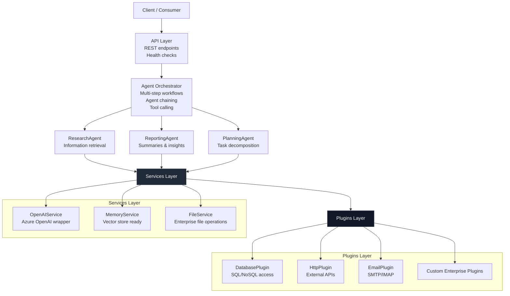
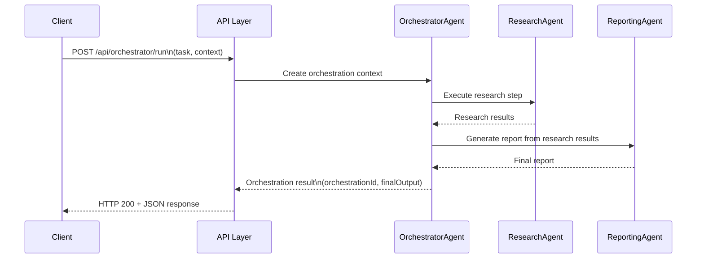
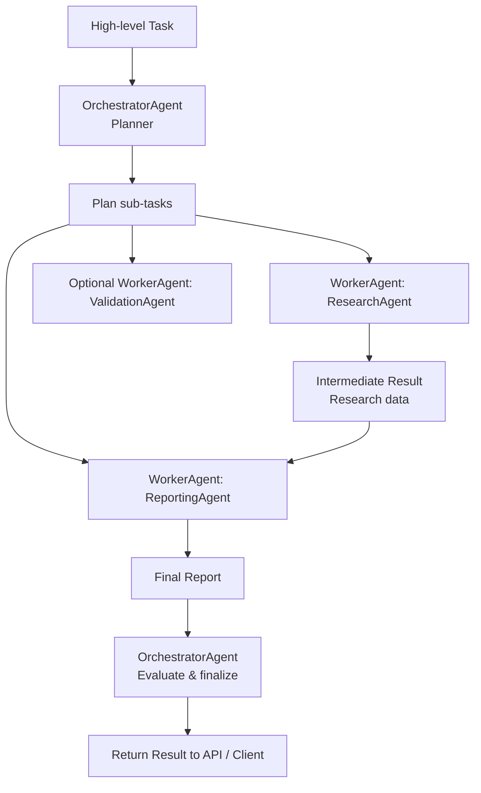

🧠 AI Agent Starter Kit — Architecture Overview

The AI Agent Starter Kit provides a modular, extensible, and enterprise-ready foundation for building autonomous systems using .NET 8, Azure OpenAI, and Copilot Extensions.

This architecture follows modern enterprise requirements:


- Clear separation of concerns (API, Agents, Services, Plugins, Domain)  
- Clean and testable code (DI-ready agents)  
- Stable abstractions (`BaseAgent.cs`)  
- Agent orchestration patterns (Planner/Worker, Chaining)  
- Extendibility through plugins (for tool use)  
- Secure integration with enterprise systems  
- Observability and diagnostics (Serilog, token tracking)

🔷 High-Level Architecture

This architecture uses a standard layered approach where the API acts as the entry point, the Agent Orchestrator manages complex workflows, and Plugins handle external tool execution.
Plaintext
 

🧩 Agent Model

Each agent provides a specific capability and inherits from the abstract base class to ensure consistency, testability, and access to shared services like logging and dependency injection.

Each agent inherits from:
```C#

abstract class BaseAgent
{
    public abstract Task<AgentResult> ExecuteAsync(AgentContext context);
}
```
An agent receives a comprehensive AgentContext which includes:

- TaskRequest: The main task description.

- Optional metadata: User IDs, session state, etc.

- Optional tools/plugins: Dynamic list of functions/plugins the agent can call.

- CancellationToken: For safe shutdown/timeouts.

The core logic resides in specialized agents (e.g., ResearchAgent, ReportingAgent), which are coordinated by the OrchestratorAgent.


🔀 Multi-Agent Workflow

The Starter Kit is designed to handle complex, long-running business processes with multiple agents collaborating.

🎛 Orchestrator Pattern

The OrchestratorAgent implements Planner → Worker and chaining patterns


Patterns supported:

- Planner → Worker pattern

    - Orchestrator receives a high-level goal

    - Decomposes into sub-tasks

    - Delegates execution to specialized agents

- Chain-of-Agents

    - Output of one agent becomes input/context for the next

- Autonomous Loop (optional)

    -   Orchestrator decides if the result is sufficient or requires refinement

- Mixed-Initiative (Copilot style)

Agent responds to the user and proposes next steps

🔌 Plugin Architecture

Plugins encapsulate external capabilities (tools) such as databases, HTTP APIs, and messaging systems.

```mermaid
flowchart LR
    subgraph Agents
        A1[ResearchAgent]
        A2[ReportingAgent]
        A3[PlanningAgent]
    end

    subgraph Services
        S1[OpenAIService]
        S2[MemoryService]
        S3[FileService]
    end

    subgraph Plugins
        P1[DatabasePlugin]
        P2[HttpPlugin]
        P3[EmailPlugin]
        P4[CustomPlugin\n(e.g. CRM, ERP, DMS)]
    end

    A1 --> S1
    A1 --> S2
    A1 --> P1
    A1 --> P2

    A2 --> S1
    A2 --> P2
    A2 --> P3

    A3 --> S1
    A3 --> S2
    A3 --> P4

``` 
Key ideas:
- Agents do not talk directly to infrastructure
- Services and Plugins encapsulate external tools
- Plugins can be swapped/mocked for testing
- New plugins can be added without touching core orchestration logic

📊 Observability

Robust logging and tracing are crucial for enterprise AI systems. Built-in support ensures full transparency:
- Serilog Logging – Structured logs across all components
- Request Correlation – Trace a single user request across multiple agent steps
- Token Usage Tracking – Log input/output token counts for cost analysis
- Agent Execution Logs – Tool calls, context summaries, and decisions
- Workflow Audit Trail – Full record of multi-step orchestrations for compliance

☁ Cloud-Native Ready

The .NET 8 minimal API and architecture are designed for flexible deployment:
- Azure Container Apps – Scalable microservices
- Azure Functions – Event-driven execution and durable orchestration
- Azure API Management – Security, throttling, external exposure
- Azure OpenAI – Secure, enterprise-grade LLM access
- Azure App Configuration / Key Vault – Centralized config and secret management

📦 Purpose

This documentation serves as the reference architectural guide for teams building
enterprise AI Agents with .NET, Azure, and Copilot ecosystems, with focus on:

- security
- scalability
- maintainability
- extensibility through agents and plugins