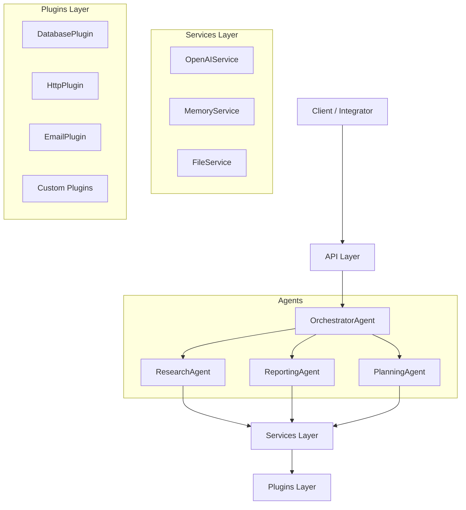

# 🤖 AI Agent Starter Kit — Documentation Hub

Welcome to the **AI Agent Starter Kit** documentation portal.

This guide provides everything you need to understand, extend, and deploy the **enterprise-grade autonomous agent framework** built on:

  * **⚡ .NET 8** (Fast & secure backend)
  * **🧠 Azure OpenAI** (Enterprise-ready LLM access)
  * **🤝 Copilot Extensions** (Integration templates)
  * **Modular Agent-Oriented Architecture**
  * **Plugin-Based Tooling System**

The Starter Kit is designed for **enterprise AI adoption**, enabling teams to build autonomous workflows, multi-agent reasoning, and AI-driven business processes.

-----

# 🗂 Documentation Structure

This documentation is organised into the following key sections:

-----

## 📘 1. Architecture

Learn how the Starter Kit is structured internally:

  * Agent model
  * Orchestrator pattern
  * Multi-agent workflows
  * Plugin architecture
  * Services (`OpenAIService`, `MemoryService`, `FileService`)

📎 **Start here:**
👉 [`architecture/overview.md`](https://www.google.com/search?q=architecture/overview.md)

-----

## 🧩 2. Agent Prompts

Guidelines and reusable templates for:

  * System prompts
  * Structured output prompts
  * Refinement loops
  * Multi-step reasoning templates

📎 **Templates:**
👉 [`prompts/agent-prompt-template.md`](https://www.google.com/search?q=prompts/agent-prompt-template.md)

-----

## 🌐 3. API Reference

Full list of API endpoints:

  * Health checks
  * Single agent invocation
  * Orchestrator workflows
  * Request/response models
  * Versioning & Authentication

📎 **Endpoints:**
👉 [`api/endpoints.md`](https://www.google.com/search?q=api/endpoints.md)

-----

# 🚀 Quick Start Guide

Follow these steps to get your AI Agent system running locally.

## 1️⃣ Clone the repository

```bash
git clone https://github.com/<your_user>/ai-agent-starter-kit.git
cd ai-agent-starter-kit
```

## 2️⃣ Restore & Run the API

```bash
dotnet restore
dotnet run --project src/API
```

API available at: `GET http://localhost:5000/health`

## 3️⃣ Invoke a Single Agent

Example request (POST): `http://localhost:5000/api/agents/ResearchAgent/run`

```json
{
  "taskDescription": "Summarize the latest EU energy policy updates.",
  "metadata": { "format": "bullet_points" }
}
```

## 4️⃣ Run a Multi-Agent Workflow (Orchestrator)

Example request (POST): `http://localhost:5000/api/orchestrator/run`

```json
{
  "task": "Generate a competitive market report for Product X.",
  "steps": ["research", "summaries", "insights"]
}
```

-----

# 🧱 Core Concepts

## 🧭 High-Level System Diagram

This diagram illustrates the flow of control from the API entry point down to the specialized agents and external tools (Plugins).



<br>

  * **✔ Agents:** Autonomous units that execute reasoning or tasks, inheriting from `BaseAgent.cs`.
  * **✔ Orchestrator:** Manages multi-step workflows, task decomposition, and agent chaining.
  * **✔ Services:** Internal capabilities required by agents (e.g., calling Azure OpenAI, handling memory).
  * **✔ Plugins:** External tools (DB, HTTP, email) used by agents for real-world interaction.
  * **✔ AgentContext:** The data carrier containing the task, metadata, and the list of permissible tools/plugins.

-----

# 🏢 Enterprise Capabilities

The Starter Kit is built for production and includes features essential for enterprise deployment:

  * **Cloud-Native:** Azure Container Apps support, Azure Functions & Durable Orchestrations.
  * **LLM Integration:** Secure Azure OpenAI GPT-4.x / GPT-4o integration.
  * **Security:** Integration with Azure API Management (security & throttling).
  * **Observability:** Logging & telemetry via Serilog, token usage tracking, and prompt governance.

-----

# 📦 Extending the Framework

Learn how to customize and expand the architecture:

  * Building new agents
  * Creating custom orchestrators
  * Developing new plugins for enterprise integrations
  * Implementing new AI workflows
  * Integrating Copilot Extensions

## 🔧 Coming Next (Documentation)

  * **Agent memory patterns** (vector store integration)
  * **Custom plugin development guide**
  * **End-to-end orchestration examples**
  * **Security & compliance patterns**
  * **GitHub Actions CI/CD templates**
  * **Azure deployment guide**

